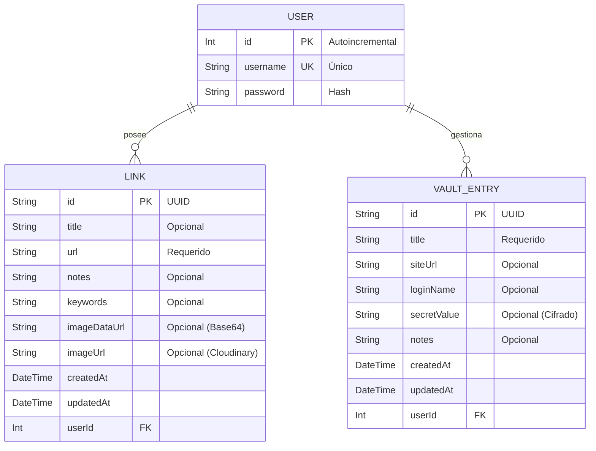

# Esquema de la Base de Datos - Antigravity Vault

Este documento detalla la estructura de la base de datos utilizada en el proyecto, basada en **Prisma** con **SQLite**.

## Diagrama de Entidad-Relación

## Descripción de Modelos

### 1. User (Usuario)
Almacena la información de autenticación de los usuarios.
- **Relaciones**: Un usuario puede tener múltiples enlaces (`Link`) y múltiples credenciales en la bóveda (`VaultEntry`).

### 2. Link (Enlace)
Almacena los marcadores o enlaces guardados por los usuarios.
- **Imagen**: Soporta tanto almacenamiento local/base64 (`imageDataUrl`) como almacenamiento externo (`imageUrl`).
- **Organización**: Permite notas y palabras clave para facilitar la búsqueda.

### 3. VaultEntry (Entrada de la Bóveda)
Almacena credenciales seguras de forma privada.
- **Seguridad**: Diseñado para guardar nombres de usuario y secretos (contraseñas o tokens) asociados a sitios web específicos.
